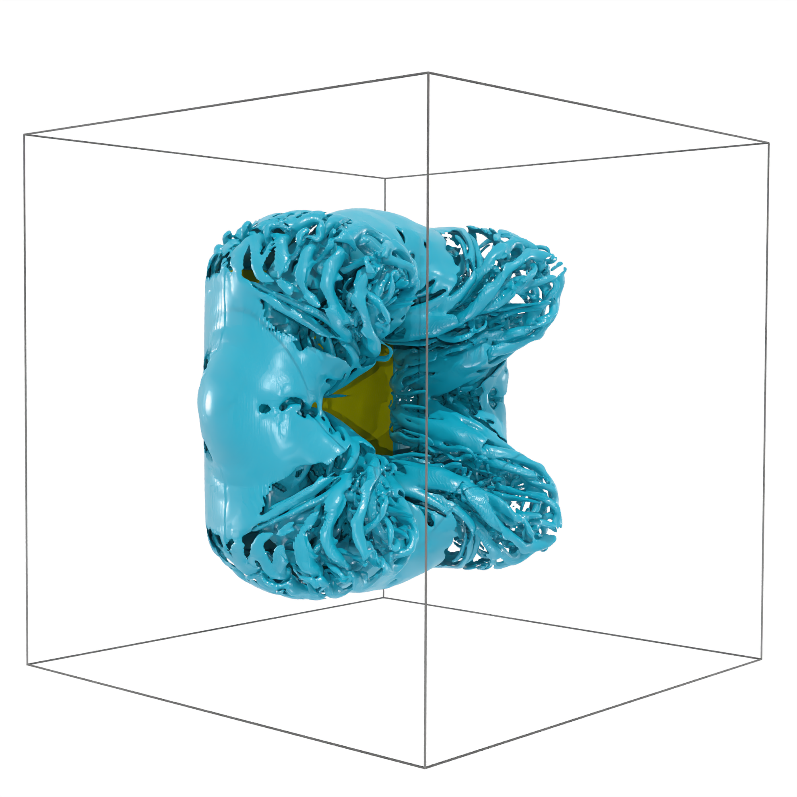

# BiotSavartBCs

[](https://github.com/weymouth/BiotSavartBCs.jl/actions/workflows/CI.yml?query=branch%3Amaster)



## Reproducing the results

To reproduce the results presented [here](https://arxiv.org/abs/2404.09034) you will need a working `Julia` kernel, preferable `v.1.10.x`. You will also need a version of the [`WaterLily.jl`](https://github.com/weymouth/WaterLily.jl) flow solver.

The first step before using these new boundary conditions is to clone this repository somewhere on your machine, I will assume that this repository is to be cloned into a `Workspace` folder on your machine. The first thing to do is to go into this directory
```bash
cd ~/Workscape
```
Then, you can clone the `BiotSavartBCs.jl` (and the `WaterLily.jl` solver if you don't already have it, or you can use the official `WaterLily` release from the `Julia` package manager)
```bash
git clone https://github.com/weymouth/BiotSavartBCs.jl
(git clone https://github.com/weymouth/WaterLily.jl)
```
The next step is to `dev` the `BiotSavartBCs.jl` into the `julia` environment you are using to run the `WaterLily` simulations.

### Activate the `BiotSavartBCs` environment

I will assume you are using `BiotSavartBCs.jl` with `WaterLily` and that you have an `examples` folder on your machine which contains a `Project.toml` file that sets the environment used to run the simulations. 

Start by opening `julia` and activate this environment
```bash
julia --project=~/Workspace/WaterLily.jl/examples
```
This will open julia, use the package manager to `dev` the `BiotSavartBCs.jl`
```julia
julia> ]
(examples) pkg> dev ~/Workspace/BiotSavartBCs.jl
...
(examples) pkg> instantiate
...
```
This will install and precompile some of the packages required for this new package.

You can the import it and use it within `WaterLily` simulations.
```julia
using BiotSavartBCs
```

### WaterLily.jl Simuations with BiotSavartBCs.jl

Using these new boundary conditions within a `WaterLily` simulation is really straight-forward, this requires only three (😱) lines of codes. The first one is obviously

```julia
using WaterLily,BiotSavartBCs
```
the second line that you have to modify is to creates the Biot-Savart integral operator (using the multi-level approach described in the paper)

```julia
ω_ml = MLArray(sim.flow.σ)              #2D flows
ω_ml = ntuple(i->MLArray(sim.flow.σ),3) #3D flows
```

The last step is to swap the standard `mom_step!` with the new Biot-Savart momentum step
```julia
mom_step!(sim.flow,sim.pois,ω_ml) # 2D and 3D flows
```
which takes care of applying these novel boundary conditions to the flow during the time-integration.

There are numerous examples in the `examples` folder of this repository that show how to use these new boundary conditions in practice.

### Limitations

This implementation is limited to flow __without__ symmetries accounted for via reflections, you need to model the full 2D or 3D problem and cannot combine it with symmetric boundary conditions out of the box (you are of course free to implement this yourself).

### Citing

We simply ask you to cite the references below in any publication in which you have made use of the `BiotSavartBCs` project. If you are using other `WaterLily` packages, please cite them as indicated in their repositories.

```bibtex
@article{weymouth2024biot,
    title={Using Biot-Savart to shrink Eulerian domains while maintaining or improving external flow accuracy}, 
    author={Gabriel D. Weymouth and Marin Lauber},
    year={2024},
    eprint={2404.09034},
    archivePrefix={arXiv},
    primaryClass={physics.flu-dyn}
}
```